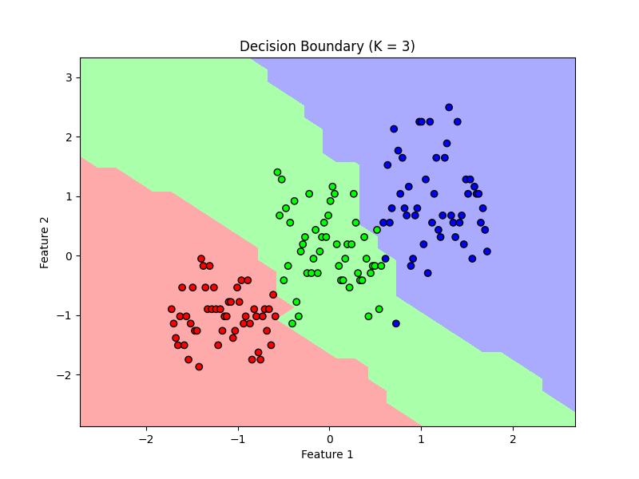

# 🌸 K-Nearest Neighbors (KNN) Classifier on Iris Dataset

This repository contains a complete implementation of the **K-Nearest Neighbors (KNN)** algorithm for classification using the **Iris dataset**.

## 📌 Task Objective
- Understand and implement **KNN** for classification problems.
- Perform **feature scaling**, model training, **K-value optimization**, evaluation, and visualization.
- Plot **decision boundaries** for a 2D projection of the dataset.

---

## 📁 Dataset
- Dataset used: `Iris.csv` (contains flower measurements and species).
- Columns: `SepalLengthCm`, `SepalWidthCm`, `PetalLengthCm`, `PetalWidthCm`, `Species`.

---

## 🛠️ Tools & Libraries Used
- Python
- `pandas`, `numpy`, `matplotlib`
- `scikit-learn` for model training, preprocessing, and evaluation

---

## 🚀 What the Code Does
1. Loads and preprocesses the Iris dataset.
2. Encodes categorical labels (`Species`) as numbers.
3. Scales the features using `StandardScaler`.
4. Splits the data into training and testing sets.
5. Trains multiple KNN models using values of K from 1 to 10.
6. Selects the **best K** based on accuracy.
7. Evaluates the final model using **accuracy score** and **confusion matrix**.
8. Visualizes decision boundaries using the **first two features**.

---

## 📊 Output

- Accuracy for each K value is printed.
- Best `K` is selected automatically.
- Confusion Matrix shows classification performance.
- Decision boundary plot is saved as:  
  📁 `decision_boundary_plot.png`

---

## 🧠 Concepts Practiced
- Instance-based learning
- Euclidean distance
- Importance of feature scaling in KNN
- Model evaluation metrics (accuracy, confusion matrix)
- Visualization of classification regions

---

## 🖼️ Example Visualization



---

## ✅ How to Run
1. Clone the repository.
2. Ensure `Iris.csv` is in the same directory.
3. Run the script using:

```bash
python main.py
